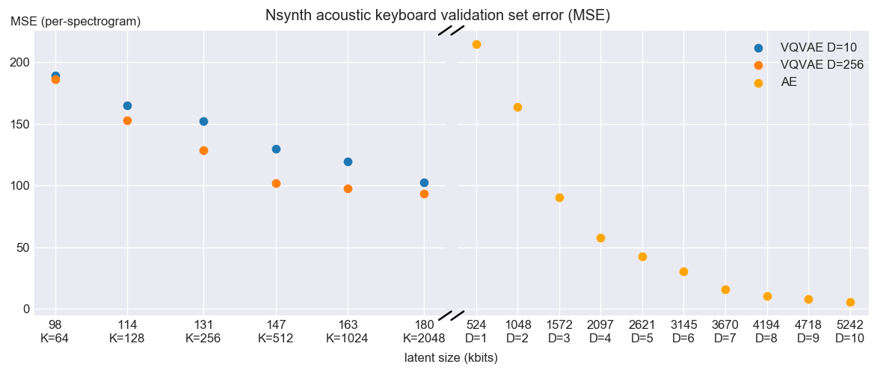
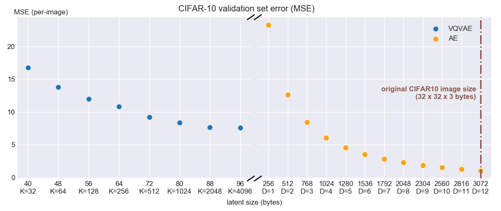

# Unsupervised Audio Spectrogram Compression using Vector Quantized Autoencoders

| [report](http://kth.diva-portal.org/smash/record.jsf?pid=diva2%3A1376201&dswid=4801) | [sound samples](https://vedal.github.io/thesis-audio-samples/) |


### Overview 
Tensorflow implementation of Unsupervised Audio Spectrogram Compression using Vector Quantized Autoencoders, which compresses (encodes) a short sound files into a compact, discrete representation, and decompresses it to a waveform again. The method relies on an intermediate "spectrogram" representation. An gradient-based approximate inverse-STFT is included for generating a sound waveform from the reconstructed spectrogram.

For additional details, please see the [report](http://kth.diva-portal.org/smash/record.jsf?pid=diva2%3A1376201&dswid=4801) and [sound samples](https://vedal.github.io/thesis-audio-samples/).


## Getting started
### Install dependencies
#### Requirements
- Python 3.7
- tensorflow==1.15.2
- dm-sonnet==1.36
- tensorflow-probability==0.8.0
```
pip install -r requirements.txt
```

### Training
The model training script `train.py` requires an configuration YAML, and the configs used in the report experiments can be found in `experiments/`. The `minimal` configs are intended for debugging. 

`python train.py -f experiments/nsynth-full.yaml`

### Evaluation
`evaluate.py` evaluates testset the predictive performance of a trained model.

### Prediction
`predict.py` compresses/reconstructs a new sound file.

### Dataset pipelines
`tf.data` input pipelines for the following datasets are included:
- `.wav` soundfiles, 4-seconds (such as [Nsynth](https://magenta.tensorflow.org/datasets/nsynth#files))
- [CIFAR10](https://www.cs.toronto.edu/~kriz/cifar.html)
- [MNIST](http://yann.lecun.com/exdb/mnist/)

### Results
Nsynth dataset validation error plots for autoencoders of increasing latent representation size.


CIFAR10-dataset


### Citation
```
@mastersthesis{HansenVedal1376201,
	title = {Unsupervised Audio Spectrogram Compression using Vector Quantized Autoencoders},	
	author = {Hansen Vedal, Amund},
	institution = {KTH, School of Electrical Engineering and Computer Science (EECS)},
	pages = {75},
	year = {2019}
}
```

