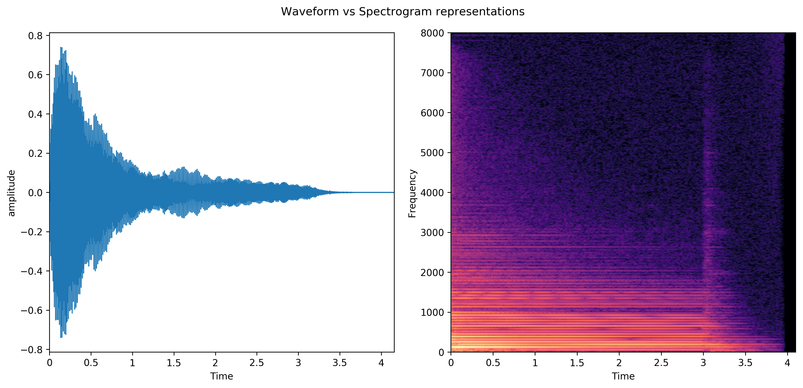
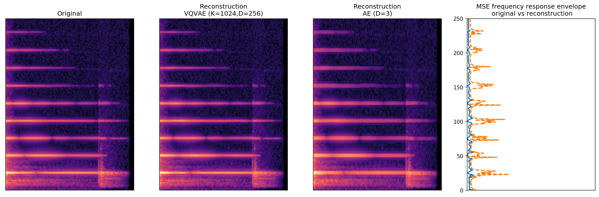

Unsupervised Audio Spectrogram Compression using Vector Quantized Autoencoders
=================================================

| [report](http://kth.diva-portal.org/smash/record.jsf?pid=diva2%3A1376201&dswid=4801) |

Tensorflow implementation of Unsupervised Audio Spectrogram Compression using Vector Quantized Autoencoders. Using this framework allows for compressing a short `.wav` sound file into a compact, discrete representation, and reconstruct it again. The method relies on an input pipeline which preprocesses the sound into an intermediate "spectrogram" representation, as well as an estimated inverse operation for post-processing.

Requirements:
- Python 3.6.5
- `tensorflow==1.13.0rc2`
- `dm-sonnet==1.27`
- `tensorflow-probability==0.5.0`

Datasets:
- `.wav` soundfiles, 4-seconds ([Nsynth](https://magenta.tensorflow.org/datasets/nsynth#files))
- CIFAR10
- MNIST

`train.py` requires an experiment setup YAML, which can be found in `experiments/`. The `minimal` experiments used only a minimal subset of the data and are intended for debugging. 

### Run cifar experiment (subset of data)
`python train.py -f experiments/cifar10-minimal.yaml`

### Run cifar experiment (whole dataset)
`python train.py -f experiments/cifar10-full.yaml`

`evaluate.py` runs the testset to evalute the predictive performance of a trained model.

`predict.py` compresses/reconstructs a new sound file.

